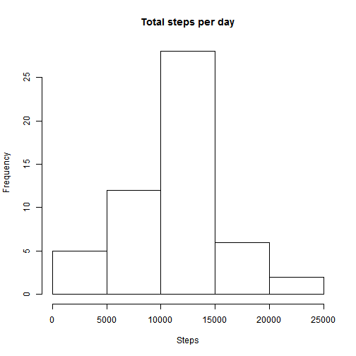
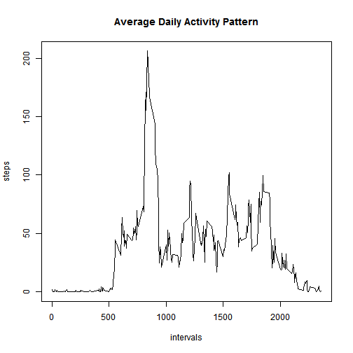
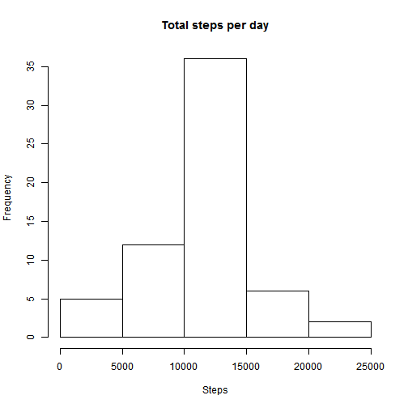
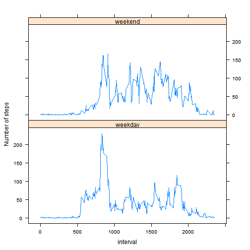

This is the rmarkdown file for Peer Review 1

Please make sure you have the unzipped file "activity.csv" in your wd and the following packages installed: lattice, dplyr and knitr.

Loading and preprocessing the data


```r
activity = read.csv("activity.csv")
```

Calculate the total number of steps taken per day and create a histogram of the total number of steps taken each day


```r
tapply(activity$steps,activity$date,sum) -> q1
hist(q1, main="Total steps per day", xlab="Steps")
```

 

Calculate and report the mean and median of the total number of steps taken per day

```r
mean(q1, na.rm = T) -> mean_per_day
median(q1, na.rm = T) -> median_per_day
print(mean_per_day)
```

```
## [1] 10766.19
```

```r
print(median_per_day)
```

```
## [1] 10765
```

What is the average daily activity pattern?

Make a time series plot (i.e. type = "l") of the 5-minute interval (x-axis) and the average number of steps taken, averaged across all days (y-axis)

```r
is.na(activity$steps) -> step_missing
activity_complete = activity[!step_missing,]
tapply(activity_complete$steps,activity_complete$interval,mean) -> mean_by_int
plot(mean_by_int,x = names(mean_by_int), type = "l",main="Average Daily Activity Pattern", xlab="intervals", ylab="steps")
```

 

Which 5-minute interval, on average across all the days in the dataset, contains the maximum number of steps?

```r
mean_by_int[mean_by_int== max(mean_by_int)]
```

```
##      835 
## 206.1698
```

Imputing missing values

Calculate and report the total number of missing values in the dataset (i.e. the total number of rows with NAs)

```r
sum(step_missing)
```

```
## [1] 2304
```
Devise a strategy for filling in all of the missing values in the dataset and create a new dataset that is equal to the original dataset but with the missing data filled in. I used the mean for the 5-minute interval calculated in the previous question

```r
activity_missing = activity[step_missing,]
for (i in names(mean_by_int)) {
  activity_missing[activity_missing$interval== i,][1] <- mean_by_int[as.character(i)]
}
activity_new = rbind(activity_complete,activity_missing)
```

Make a histogram of the total number of steps taken each day and Calculate and report the mean and median total number of steps taken per day. 

```r
tapply(activity_new$steps,activity_new$date,sum) -> q4
hist(q4, main="Total steps per day", xlab="Steps")
```

 

Do these values differ from the estimates from the first part of the assignment? What is the impact of imputing missing data on the estimates of the total daily number of steps?

```r
mean(q4)
```

```
## [1] 10766.19
```

```r
median(q4)
```

```
## [1] 10766.19
```

```
## [1] "The mean remains the same and the median changes slightly. Since I used the means to replace all NAs, the mean and median are now the same."
```
Are there differences in activity patterns between weekdays and weekends?

Create a new factor variable in the dataset with two levels �C “weekday” and “weekend” indicating whether a given date is a weekday or weekend day.

```r
# Please note that some of the characters, "星期六" (Sat) and "星期日" (Sun) are displayed in the system default languange, which may not be supported in your system
weekdays(as.Date(activity_new$date)) == "星期六" -> Sat
weekdays(as.Date(activity_new$date)) == "星期日" -> Sun
weekends <- Sat | Sun
days = c()
for (i in 1:length(weekends)){
  if (weekends[i] == T) {
    days = c(days, "weekend")
  }
  else {
    days = c(days, "weekday")
  }
}
cbind(activity_new, days) -> activity_days
```
Make a panel plot containing a time series plot (i.e. type = "l") of the 5-minute interval (x-axis) and the average number of steps taken, averaged across all weekday days or weekend days (y-axis). 

```r
library(dplyr)
```

```
## 
## Attaching package: 'dplyr'
## 
## The following objects are masked from 'package:stats':
## 
##     filter, lag
## 
## The following objects are masked from 'package:base':
## 
##     intersect, setdiff, setequal, union
```

```r
library(lattice)
activity_days <- activity_days %>% 
  group_by(days,interval) %>%
  summarise(step_mean = mean(steps))
with (activity_days, 
      xyplot(step_mean ~ interval|days, type="l", 
             ylab="Number of steps",layout=c(1,2)))
```

 


